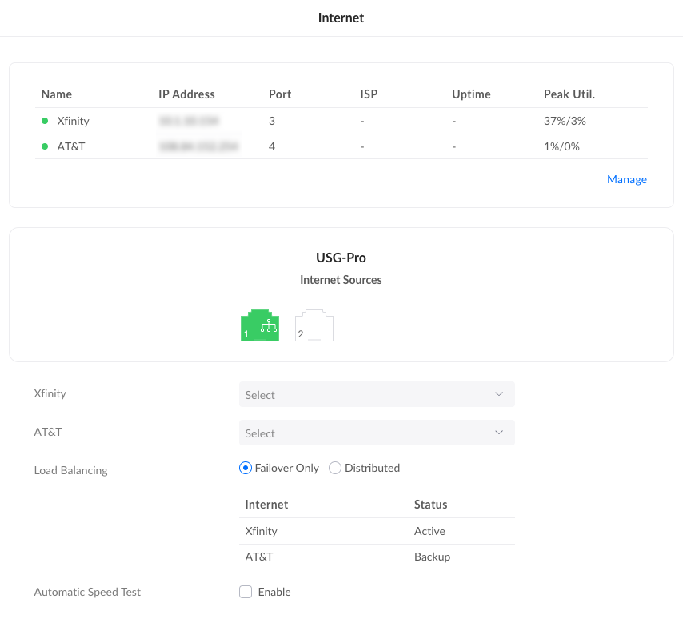
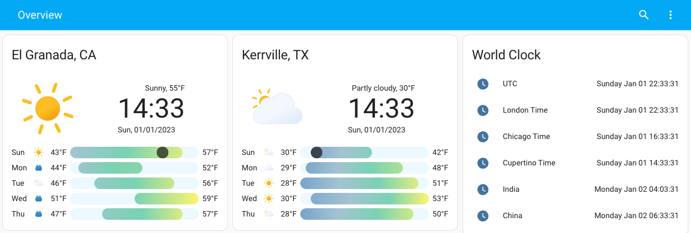
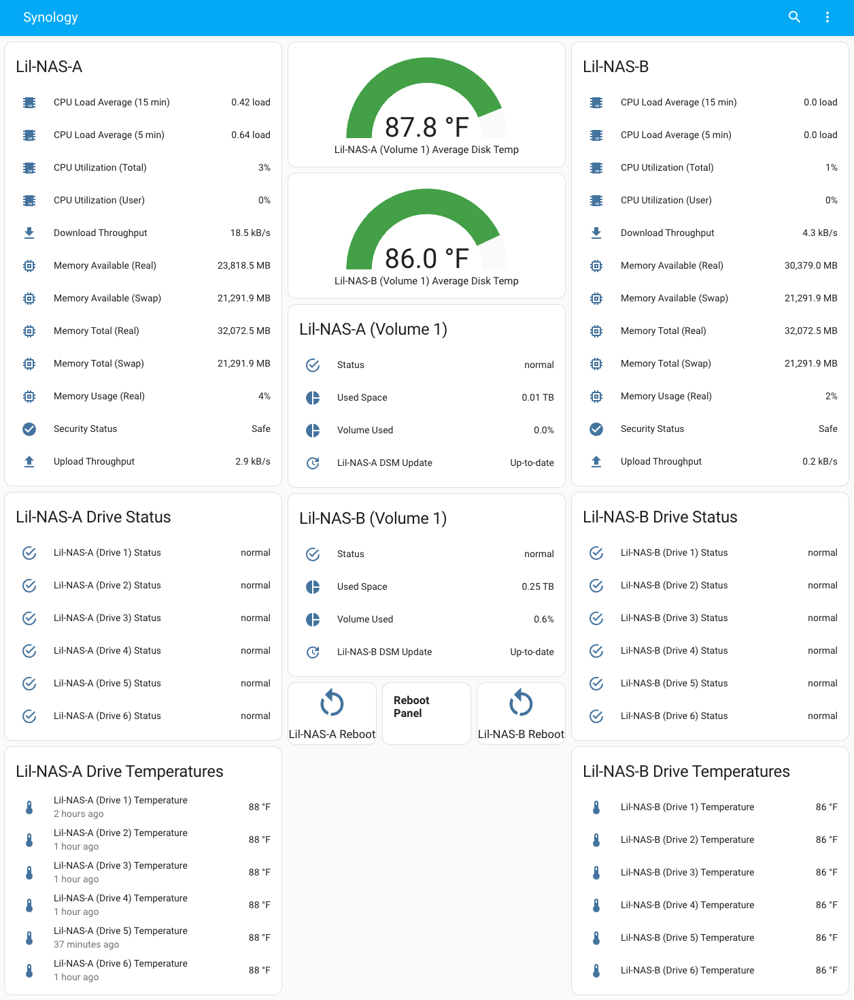

# Overview

My personal [Home Assistant Container](https://home-assistant.io)
configurations.

I utilize Home Assistant to bridge and automate all my home automation products.
It was quickly realized as I expanded beyond some smart bulbs and a Hue hub,
that nothing integrated into a single system for control, automation, and
communication. Home Assistant originally was run on a Raspberry Pi but I have
since moved it to run as a docker container running on a [Synology NAS
DiskStation DS1621+](https://www.synology.com/en-us/products/DS1621+)

## Architecture

I'm running two internet connections here at the house. The first is
Xfinity/Comcast Business Internet Gigabit Extra (1.25 Gbps / 35 Mbps) and the
other is AT&T's Internet 100 (100 Mbps / 25 Mbps). Both of these routers are
plugged into a [Ubiquiti Security Gateway Pro
(USG-PRO-4)](https://store.ui.com/collections/routing-switching/products/unifi-security-gateway-pro)
which is rack mounted in my Garage/Home Office/Man Cave. You can configure the
USG-Pro to either do WAN Failover or WAN Load Balancing. I've configured the
USG-Pro-4 to utilize WAN Failover.

_USG-Pro-4 WAN Failover_

> **What is WAN Failover?**
>
> Failover enables you to connect a second Internet connection to your UniFi
> Gateway which will serve as a “backup”. If your primary Internet service goes
> down, you will begin utilizing your secondary Internet connection.

> **How does UniFi determine if my Internet goes down?**
>
> The UniFi Network Application checks for connectivity and latency to an “echo
> server”. By default, this is set to ping.ui.com which leverages responses from
> various locations to ensure maximum accuracy.

In addition to the two WAN connections, UniFi Gateways also support the use of
our UniFi LTE Backup which is connected to a LAN port. This is only capable of
being used as a failover option.

While I have the [UniFi
LTE](https://store.ui.com/collections/wireless/products/unifi-lte) I've yet to
configure it for use.

## Gear/Equipment

This list of gear/equipment is not complete.

### Networking

- [Cloud Key Gen2 Plus](https://store.ui.com/collections/unifi-protect-nvr/products/unifi-cloudkey-plus) x1
- [Security Gateway Pro (USG-PRO-4)](https://store.ui.com/collections/routing-switching/products/unifi-security-gateway-pro) x1
- [UniFi LTE](https://store.ui.com/collections/wireless/products/unifi-lte) x1
- [Switch 24 PoE](https://store.ui.com/collections/unifi-network-switching/products/usw-24-poe) x1
- [Switch Pro 48 PoE](https://store.ui.com/collections/unifi-network-switching/products/usw-pro-48-poe) x1
- [Switch Pro 48](https://store.ui.com/collections/unifi-network-switching/products/usw-pro-48) x1
- [Switch Aggregation](https://store.ui.com/collections/unifi-network-switching/products/unifi-switch-aggregation) x1
- [SmartPower PDU Pro](https://store.ui.com/products/usp-pdu-pro) x1
- [Access Point FlexHD](https://store.ui.com/collections/wireless/products/unifi-flexhd) x5

### NAS

- [Synology NAS DiskStation DS1621+](https://www.synology.com/en-us/products/DS1621+) x2
  - [Synology 10Gb Ethernet Adapter 2 SFP+ Ports (E10G21-F2)](https://www.synology.com/en-us/products/E10G21-F2)

## Screenshots

_Entry Point into the Dashboards_

_Synology Dashboards_

## Features

- Turning on lights depending on the time of day (sunrise/sunset)
- Smoke Alarms/CO2 Detection
- Printer low ink notification
- Doorbell notification
- Low battery on devices
- High humidity notification

**Note: Private information is stored in secrets.yaml (not uploaded)**
